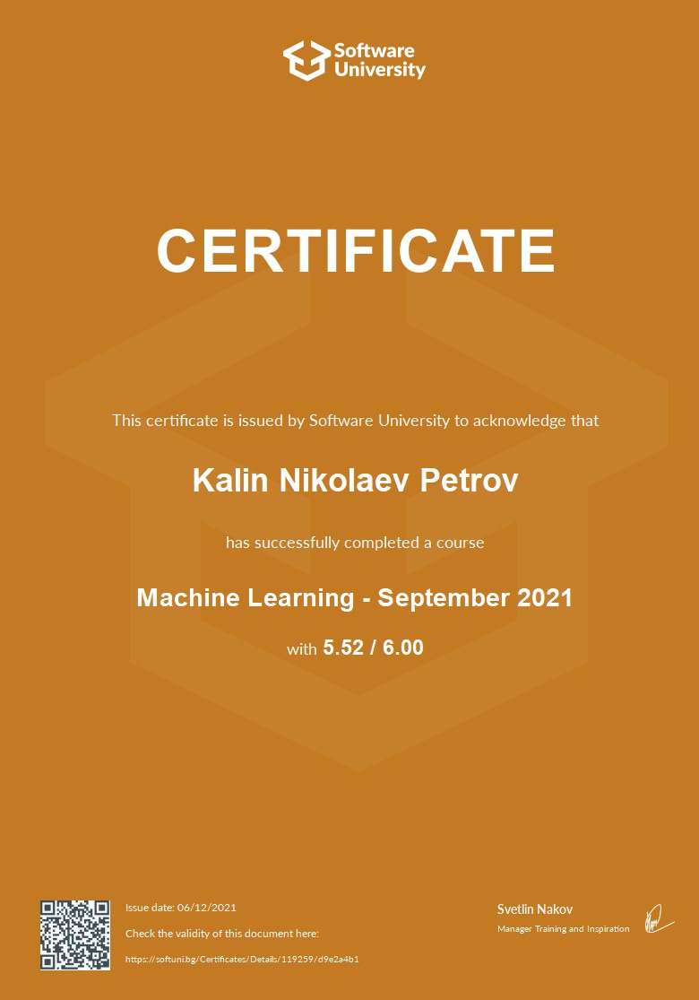

## Machine Learning

### COURSE CURRICULUM:

1. Introduc􀀉on to Machine Learning
2. Linear and Logis􀀉c Regression
3. Model Training and Improvement
4. Tree and Ensemble Methods
5. Support Vector Machines
6. Clustering
7. Dimensionality Reduc􀀉on
8. Introducton to Neural Networks
9. Exam Prepara􀀉on: End-to-end Project
10. Course Summary

